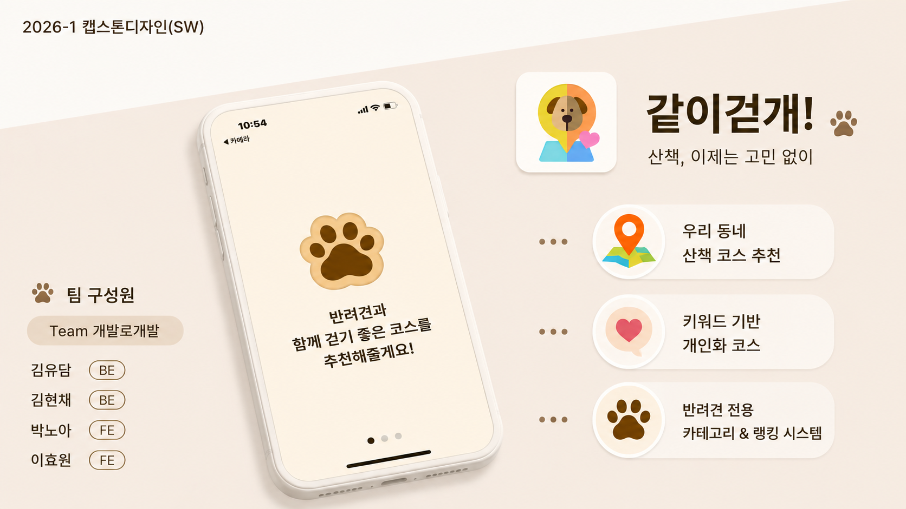

# 같이걷개!

## 1. 팀원 소개

| 이름 | 학번 | 역할 |
|------|------|------|
| 김현채 | 32221338 | Backend · 팀장 |
| 김유담 | 32220981 | Backend | 
| 박노아 | 32211599 | Frontend |
| 이효원 | 32223748 | Frontend | 

---

## 2. 프로젝트 개요

같이걷개!는 반려견 산책 경로를 추천하고, 산책 기록과 반려견 정보를 함께 관리할 수 있는 모바일 서비스입니다.

### 주요 기능

- 산책 경로 추천
- 랭킹 기능
- 사용자 프로필, 반려견 프로필 설정 
- 반려견 관련 상담 AI 챗봇

### 사용 기술

#### - Frontend
- React Native
- Expo
- JavaScript
- Kakao Maps API

#### - Backend
- Docker
- Node.js (Express)
- FastAPI (python)
- JWT 인증

#### - Database
- Supabase
- PostgreSQL + PostGIS

#### - AI
- Gemini 2.5 Flash Lite

---

## 3. 실행 환경 및 방법

👉 <a href="./frontend/README.md" target="_blank" rel="noopener noreferrer">같이걷개! 실행 가이드</a>

---

## 4. 포스터

---

## 5. 시연 영상

👉 <a href="https://www.youtube.com/watch?si=xo0iMZguorsXAbT9&v=30mEUgaWlh8&feature=youtu.be" target="_blank" rel="noopener noreferrer">같이걷개! 시연 영상</a>

---

## 6. 결과 보고서

👉 [결과 보고서](./docs/DogWalk_결과보고서.pdf)

---

## 7. 발표 자료

👉 <a href="./docs/같이걷개!_발표자료.pdf" download="같이걷개_발표자료.pdf" target="_blank" rel="noopener noreferrer">발표 자료 확인</a>